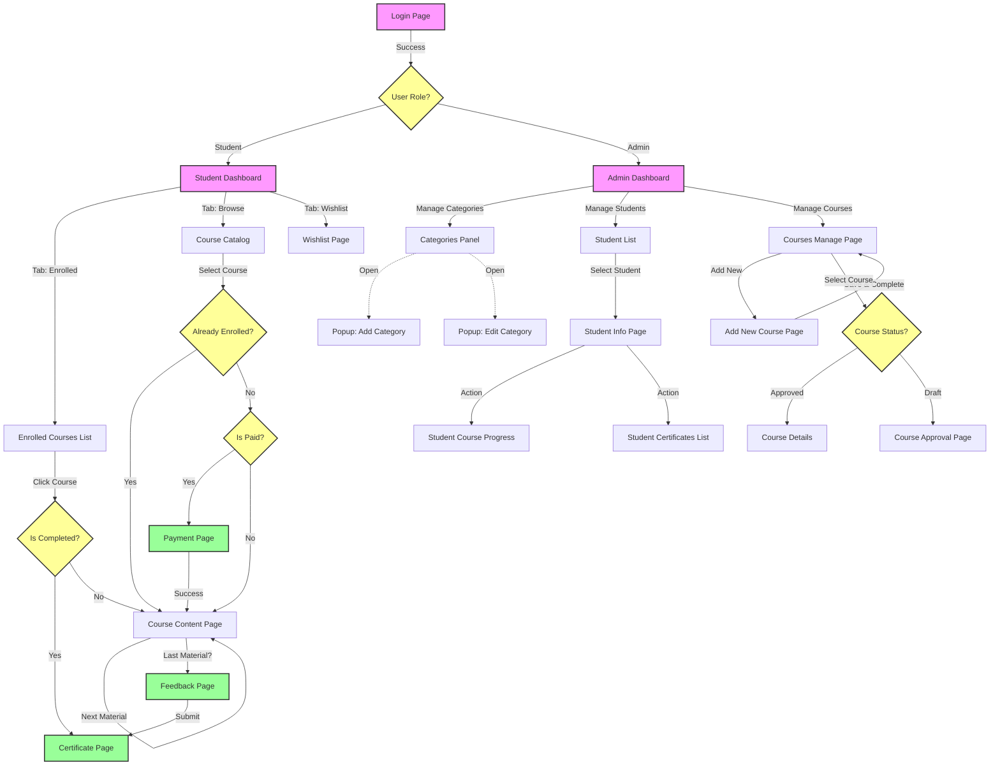

```mermaid
graph TD
    %% --- ENTRY POINT ---
    Login[Login Page] -->|Success| RoleSwitch{User Role?}

    %% ==========================================
    %% STUDENT FLOW
    %% ==========================================
    RoleSwitch -->|Student| SD[Student Dashboard]
    
    %% 1. Browse / Dashboard Tabs
    SD -->|Tab: Enrolled| EnrolledList[Enrolled Courses List]
    SD -->|Tab: Browse| Catalog[Course Catalog]
    SD -->|Tab: Wishlist| Wishlist[Wishlist Page]

    %% 1-1. Enrolled Logic
    EnrolledList -->|Click Course| CheckComplete{Is Completed?}
    CheckComplete -->|Yes| CertPage[Certificate Page]
    CheckComplete -->|No| Content[Course Content Page]

    %% 1-2. Browse/Catalog Logic
    Catalog -->|Select Course| CheckEnrolled{Already Enrolled?}
    CheckEnrolled -->|Yes| Content
    CheckEnrolled -->|No| CheckPaid{Is Paid?}
    
    CheckPaid -->|Yes| Payment[Payment Page]
    Payment -->|Success| Content
    CheckPaid -->|No| Content

    %% 2. Content & Progression Logic
    Content -->|Next Material| Content
    Content -->|Last Material?| Feedback[Feedback Page]
    Feedback -->|Submit| CertPage

    %% ==========================================
    %% ADMIN FLOW
    %% ==========================================
    RoleSwitch -->|Admin| AD[Admin Dashboard]

    %% 1. Categories Branch
    AD -->|Manage Categories| CatPanel[Categories Panel]
    CatPanel -.->|Open| PopAddCat[Popup: Add Category]
    CatPanel -.->|Open| PopEditCat[Popup: Edit Category]

    %% 2. Student Management Branch
    AD -->|Manage Students| StuList[Student List]
    StuList -->|Select Student| StuInfo[Student Info Page]
    
    StuInfo -->|Action| StuProg[Student Course Progress]
    StuInfo -->|Action| StuCerts[Student Certificates List]

    %% 3. Course Management Branch
    AD -->|Manage Courses| CourseMgmt[Courses Manage Page]
    
    %% 3-1. Add New
    CourseMgmt -->|Add New| AddCourse[Add New Course Page]
    AddCourse -->|Save & Complete| CourseMgmt

    %% 3-2. Existing Courses Logic
    CourseMgmt -->|Select Course| CheckStatus{Course Status?}
    CheckStatus -->|Approved| CDetails[Course Details]
    CheckStatus -->|Draft| CApproval[Course Approval Page]

    %% Styling for visual clarity
    classDef main fill:#f9f,stroke:#333,stroke-width:2px;
    classDef decision fill:#ff9,stroke:#333,stroke-width:2px;
    classDef term fill:#9f9,stroke:#333,stroke-width:2px;

    class Login,SD,AD main;
    class CheckComplete,CheckEnrolled,CheckPaid,RoleSwitch,CheckStatus decision;
    class CertPage,Feedback,Payment term;
```
